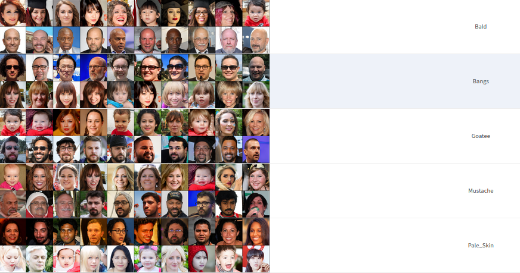

# Disentangling Minor Factors of Variations

Current SOTA unsupervised disentangling methods discover factors of variations which are dominant in the dataset(Gender,Smiling,Age in CelebAHQ dataset), while it fails to discovers factors of variation which are less prominant(Skin Color,Mustache,Goatee e.t.c). Supervised methods require pretrained classifiers, which may not be available. In this work, We devise an algorithm which can capture desired factors of variations in a Few shot setting.

## Prerequisites
- Ubuntu
- Python 3
- NVIDIA GPU + CUDA CuDNN




## Setup

- Clone this repo:
```bash
git clone https://github.com/kadarsh22/disentanglement_based_active_learning.git
cd disentanglement_based_active_learning
```

- Install dependencies:
	- Install dependcies to a new virtual environment.
	```bash
	pip install -r requirements.txt
